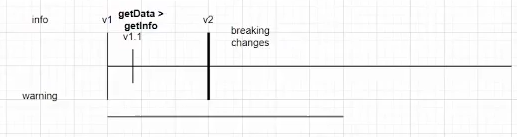
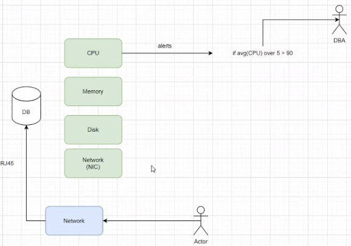
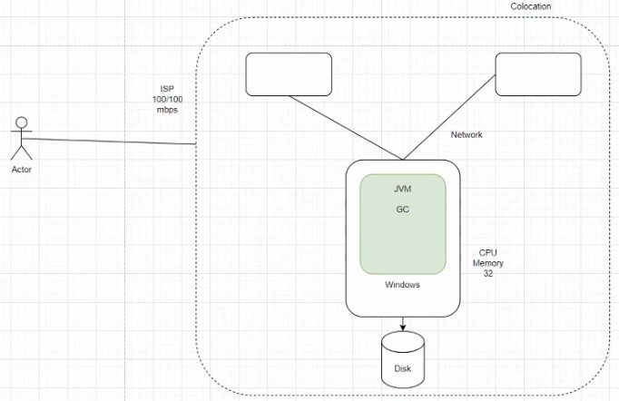

##### Apuntes 03/03/23
##### Fiorella Zelaya - 2021453615

# Observabilidad

## Logs

Existen bibliotecas que se pueden usar para manejar los logs. Normalmente se utilizan logs de 3 tipos:

- __Info:__ información que se desea desplegar al usuario.
- __Warning:__ No se trata de un error, pero la aplicación indica que algo no está bien o que algo puede potencialmente ser un error. 
    
    > *Ejemplo: Todo software tiene un ciclo de vida y viene dado por versiones. Se tienen versiones mayores, que se ejecutan normalmente como v1, y versiones menores, que son pequeños arreglos que se le van agregando al software. Estas versiones menores están entre versiones mayores.*
    > 
- __Error:__ Se trata de cuando algo sucedió que no permitió que se ejecutara correctamente la aplicación.
    > *Buena práctica de programación: Tener un buen manejo de errores. Siempre capturar los posibles escenarios de errores y hacer el análisis correcto de estos.*
- __Debug:__ Para entender este log, se puede pensar en cuando se utilizan prints para identificar el error en un código. Se le suele asignar un nivel de verbosity (0, 1, 2, 3). 
    > *Verbosity: Se trata de cuántos mensajes de debug/información se van a mostrar al ejecutar la aplicación.*

### __Rendimiento en todo sistema computacional__

Se recordarán algunas operaciones...

- __Stdout:__ (Monitor) Se usa cuando la app está corriendo y comienza a mostrar información. 

    Cuando se ejecuta esta operación, en bases de datos se va a redireccionar a un archivo en disco. Cualquier tipo de log se va a mandar a escribir al stdout y el stdout lo va a mandar a escribir en disco, lo cual implica timeouts, bloqueos por entrada y salida, etc. __La información del log es importante, pero debe usarse de forma sabia, porque puede ser muy cara en términos de rendimiento.__
- __Stderr__
- __Stdinp:__ (Teclado o mouse) Cada operación de este tipo se va a quedar asociada a una interrupción de entrada y salida. Es una operación muy cara en términos de procesamiento.

Los logs son lo más importante para identificar problemas con nuestras apps. 

---

## Monitoreo

__Servicios síncronos:__ Se interactúa en tiempo real con el servicio.
__Servicios asíncronos:__ No interactúa en tiempo real con el servicio.

Normalmente en un sistema computacional se cuenta con ciertos componentes, en los cuales siempre se está pendiente:
- __CPU__
- __Memoria RAM__
- __Disco__
- __Network (Network Interface Card)__

Hace unos años la preocupación consistía en tener métricas de un sistema aislado, es decir, únicamente de cierto componente. Se definían alertas con ciertas condiciones que le avisaban al usuario cuando había problemas, este usuario era el puesto de DBA (Database Administrator). En eso consistía el monitoreo. 

Un detalle importante es que la tecnología cambia muy rápido, por lo que siempre se debe procurar darle mantenimiento al software y actualizarlo, además de usar buenos patrones de programación. De lo contrario, el sotfware dejara de utilizarse. *Ejemplo: Nagios, Windows phone, Microsoft.*

Entonces, los sistemas fueron evolucionando. Resultó que, aunque todos los componentes anteriores estuvieran funcionando, los usuarios no podían acceder a la BD, así que decidieron hacer un monitoreo de la Network, dándose cuenta de que la red funcionaba mediocremente. Cambió entonces el paradigma del análisis de sistemas aislados, y decidieron comenzar a realizar __observabilidad.__

---

## Observabilidad

Consiste en el monitoreo de todo lo que hay en el sistema computacional, incluyendo los componentes e interacciones de usuarios.

Un sistema computaciones tiene muchísimos componentes. Por ejemplo: Elasticsearch. 

> Elasticsearch tiene un nodo, que tiene un disco asignado, así que accede al disco de cierta forma. La instancia de Elasticsearch va a tener una configuración especifica de CPU. También se cuenta con la memoria, limitada a 32 GB de RAM en términos de JVM. La JVM tiene el garbage colector, y otras métricas. Además de eso, se puede tener más nodos de elasticsearch, de modo que formen un clúster, y cada uno de esos nodos va a tener su propia configuración. Estas computadoras se conectan a una red, y van a estar corriendo un SO que a su vez está corriendo más procesos. El sistema va a tener lo que se conoce como __colocation__. Asimismo, se tiene una conexión a internet, que la provee un ISP. Por otro lado, se tienen los usuarios... Entre muchos otros componentes.

> __Colocation:__ ubicación geográfica donde se encuentra la base de datos. 

La observabilidad ve como un todo el sistema computacional. Por ejemplo, si se observa un uso de CPU, el objetivo es que se pueda correlacionar en tiempo real por qué el CPU está alto con respecto al resto de componentes del sistema. De esta forma sea posible identificar problemas de una manera más eficiente y solucionarlos.

La observabilidad se puede juntar con la elasticidad para la toma de decisiones en tiempo real en la base de datos, mediante el monitoreo completo. 
> Elasticidad: Permite que el sistema computacional crezca o reduzca su tamaño en tiempo real.

Es importante recalcar que un sistema computacional está conformado por múltiples bases de datos y múltiples capas de desarrollo de software que tienen las compañías. En sistemas tan grandes y con tantos componentes lo que se necesita es un sistema que monitoree de forma inteligente.

### __Observabilidad + Logs__

Con Inteligencia Artificial los sistemas computacionales pueden capturar toda la información que genera una aplicación desde simples métricas hasta logs. En tiempo real, con observabilidad, se puede obtener toda la información que hay por detrás de distintas interacciones en la app.

¿Que hace posible que se dé la observabilidad? Un tipo de bases de datos llamados __Timeseries Databasases.__ Es el corazón de todo lo que es monitoreo y observabilidad. Se trabaja con series de tiempo (timestamps).
> __Timestamps:__ Hora a la que entra un objeto a la base de datos.
    No todo dato de este tipo que entra en la base de datos es un dato valido para una base de datos de tipo Timeseries.

> Requisitos para que un timestamp sea un dato válido:
> - Datos con timestamp y datos de streaming.
> - Tiempo de vida de interés corto: Los datos pierden relevancia con el pasar del tiempo, ya que lo que se busca al observar un sistema es poder __tomar decisiones en tiempo real__. Entonces, las bases de datos de tipo Timeseries definen __layers de storage__ o __data tiers__ para evitar el __bottle neck__. La información hot va a estar en el mejor hardware.

> __Bottle Neck:__ Es cuando se alcance el límite de capacidad de transferencia de datos en un sistema computacional. Esto produce una baja en el rendimiento.
> __Glacier:__ Son datos que no se acceden frecuentemente. Existen regulaciones para este tipo de datos, por ejemplo, cuánto tiempo se deben mantener.

Este tipo de base de datos es muy útil porque mantiene los datos más recientes y relevantes para un mejor procesamiento. 

---

## Conceptos importantes

__Prometheus:__ Base de datos no SQL que se usa para monitoreo.

__Managed services:__ Se compra un servicio administrado por una tercera persona, pero se paga por toda la infraestructura que se utilice. Siempre se debe especificar las características y configuraciones que se necesita.

__Platform as Service (PasS):__ Quien vende el servicio solo brinda una base de datos garantizando que siempre va a estar arriba y tendrá un buen tiempo de respuesta, pero no comparte las características ni las configuraciones de la base de datos. Es un sistema simple en el cual se paga por el uso de una base de datos y se desconoce lo demás.

__Software as a Service (SaaS):__  En lugar de mantener el software, se paga a un tercero que desarrolle el sistema de forma que este defina. No se tiene ninguna decisión acerca de esto. Esto evita que se mantengan recursos innecesarios que solo se utilizan de vez en cuando. *Ejemplo: Cloud Providers.*

Ejemplos de sistemas de monitorio que incluyen IAs y otras tecnologías:
-	Dynatrace
-	Newrelic
-	Datadog

> __Nota:__ Antes de pensar en administrar un servicio, es mejor optar por Saas o PaaS. Estos servicios suelen ser más baratos y facilitan el mantenimiento de software.

